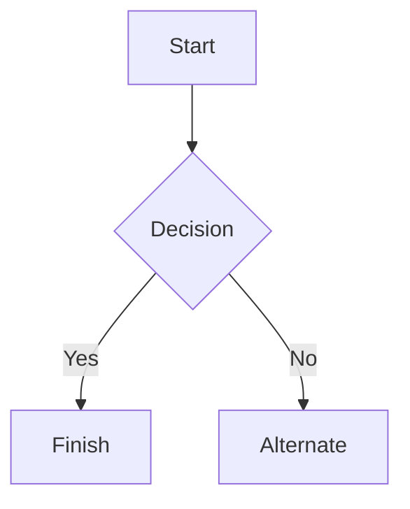

edit on https://markdownlivepreview.com/

# IVnet
Connect your generation IV Pokemon games to the Internet!

## Installation
### Requirements

Need: iw, rfkill, iptables, hostapd, dnsmasq, gcc.

Create install commands for major package managers.

`Use single weird apostrophes for inline code blocks.`
```
Use triple weird apostrophes for whole code blocks.
```

ON LAPTOP, check if raylib needs installation after git cloning. If so, provide a link to [raylib](https://github.com/raysan5/raylib) for the installation process.

### Build

Use the ivnetMake script to compile the frontend and backend. Use ivnetRun to run the system, or run `bin/ivnet`

## Hardware guide
### External Network Interface Devices
I recommend using an external NID as the Access Point for IVnet, as it is less likely to pose a risk to your systems built-in network devices. <br><br>
In my testing and usage, I have been using an [**AR9271 USB WiFi Adapter**](https://www.amazon.co.uk/dp/B0BRG6587D?ref=ppx_yo2ov_dt_b_fed_asin_title). The Linux kernel supports it natively and I have had no issues with it. <br><br>
It would be, again, greatly appreciated if information on how other external NIDs work with IVnet could be collected, to display here for all to see.<br>
From my own research, the device must be capable of the following:
- 2.4 GHz Wifi **only**.
- Standard 2.4GHz channels (1 through 11).
- IEEE 802.11b / 802.11g support.
- Access Point suport.
- nl80211 Linux interface support.
- Unencrypted network support.

### Built-in Network Interface Cards
If your system is using Ethernet as its main connection to the Internet, it should be safe to use a built-in NIC as the Access Point for IVnet. This is currently untested, and feedback on this would be greatly appreciated.<br>
The list above on required capabilities should also apply for a built-in NIC.

## More information
### Background
I started IVnet because, before the program was made, the only way you can connect the generation IV games to custom servers, feasably, was by using either an old router that only supported WEP WiFi encryption (which the DS supports, unlike the newer WPA protocols), or an unsecure mobile hotspot with something like an Android. <br><br>
I had neither, and after hearing about and watching MattKC's work on [Vanilla](https://github.com/vanilla-wiiu/vanilla), I decided to learn how to use a USB WiFi adapter to connect to the Internet. I am proud to say that it works!<br><br>
On the backend, the main programs running are [hostapd](), which deals with turning the NID into an Access Point, and [dnsmasq](), which turns the NID into a DHCP server, thus allowing it to assign IP addresses to connecting systems, like the Nintendo DS, and rerouting traffic to a specified DNS server. It also allows for a custom SSID to be used.<br><br>
Due to this being an unsecure Access Point, **ensure the Access Point is up only for as long as needed**. A timer of 3 hours is set by default to time out the AP.

### ISO 3166-1 alpha-2 codes
IVnet requires that you configure your "country code" AKA your ISO 3166-1 alpha-2 national code. This is to ensure that the programs ran by IVnet (specifically hostapd) are compliant with your country's WiFi laws and regulations. <br><br>
All of the country codes can be found [here](https://en.wikipedia.org/wiki/ISO_3166-1_alpha-2).

### What's next?

- Work on and test ports to Linux Virtual Machines and WSL.
- Work on potential bugs that may crop up.
- Work on list of compatible Network Interface Devices.
- Improve the frontend visually, such as adding a background image.
- Expanding the user-set configuration options, if needed. 


# Markdown syntax guide

## Headers

# This is a Heading h1
## This is a Heading h2
###### This is a Heading h6

## Emphasis

*This text will be italic*  
_This will also be italic_

**This text will be bold**  
__This will also be bold__

_You **can** combine them_

## Lists

### Unordered

* Item 1
* Item 2
* Item 2a
* Item 2b
    * Item 3a
    * Item 3b

### Ordered

1. Item 1
2. Item 2
3. Item 3
    1. Item 3a
    2. Item 3b

## Images


## Links

You may be using [Markdown Live Preview](https://markdownlivepreview.com/).

## Blockquotes

> Markdown is a lightweight markup language with plain-text-formatting syntax, created in 2004 by John Gruber with Aaron Swartz.
>
>> Markdown is often used to format readme files, for writing messages in online discussion forums, and to create rich text using a plain text editor.

## Tables

| Left columns  | Right columns |
| ------------- |:-------------:|
| left foo      | right foo     |
| left bar      | right bar     |
| left baz      | right baz     |

## Blocks of code

```
let message = 'Hello world';
alert(message);
```

## Mermaid diagrams


## Inline code

This web site is using `markedjs/marked`.
